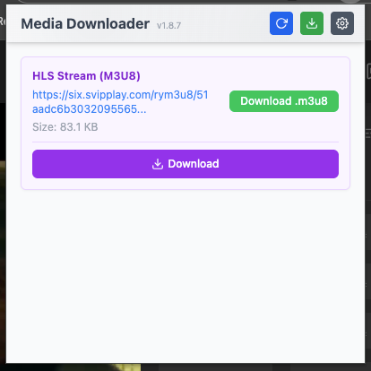
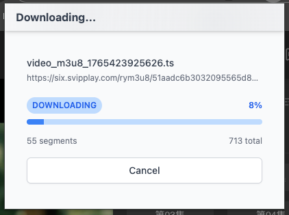
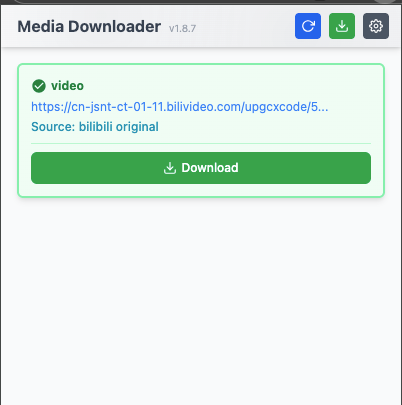
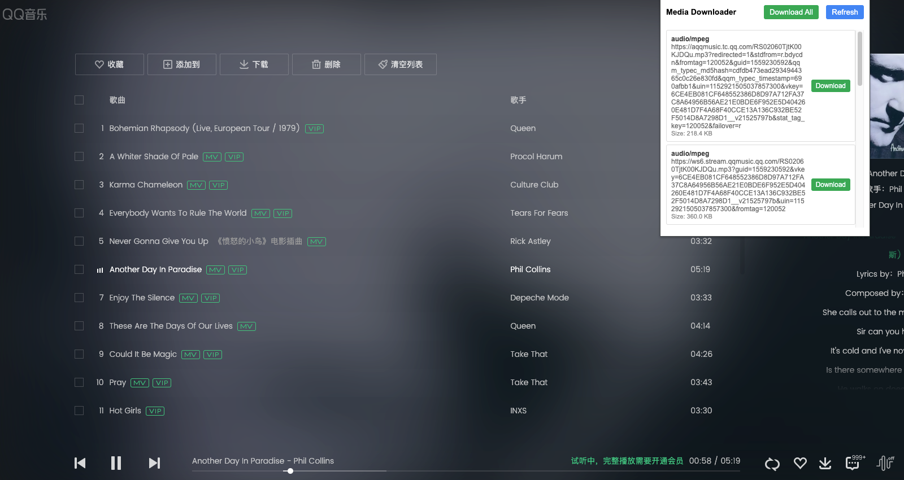
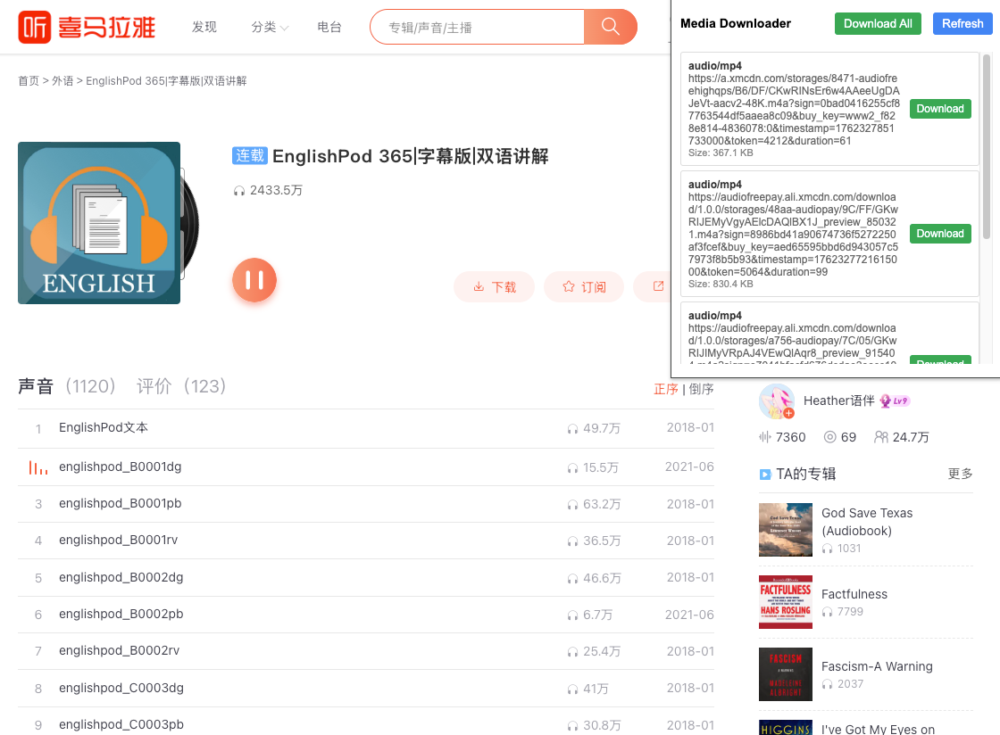
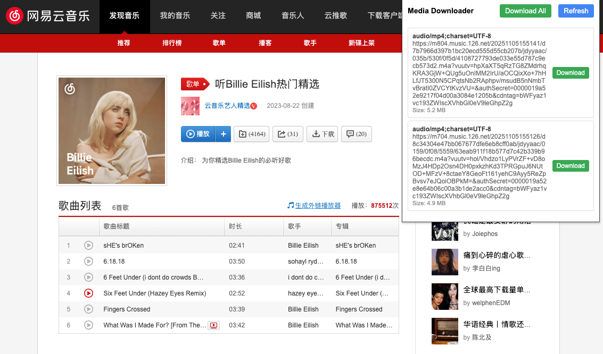
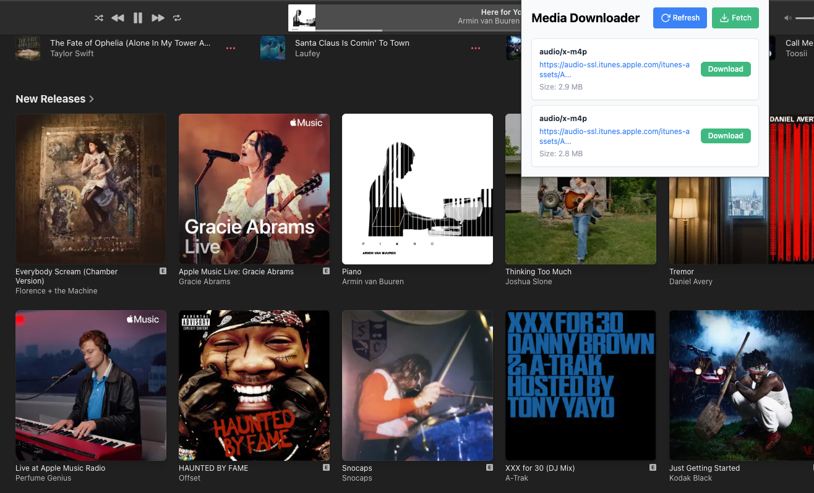
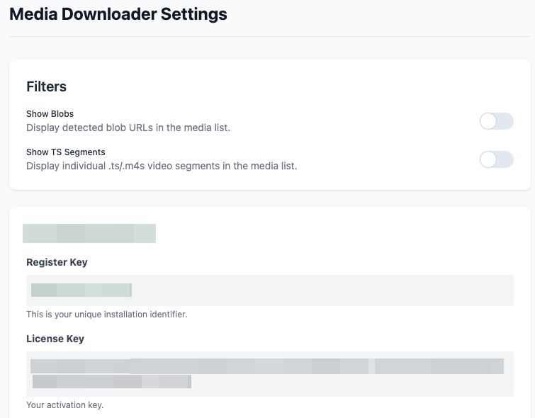

# Media Downloader Chrome Extension

A Chrome extension that automatically detects video and audio media on web pages and provides an easy way to download them.

## Installation

1. Download or clone this repository
2. Open Chrome and go to `chrome://extensions/`
3. Enable "Developer mode" in the top right
4. Click "Load unpacked" and select the extension directory
5. The extension should now be installed and visible in your toolbar

## Features

The Media Downloader Chrome Extension is designed to automatically detect and download media files from various websites, including popular platforms like **QQ Music**, **Ximalaya**, **Netease Cloud Music**, **Bilibili**, **Suno**, **Spotify**, **Apple Music** and **Douyin**. It supports **HLS (M3U8)** streaming video downloading and merging!

### Settings

- **Media Display Options**: Configure whether to display video segments or blobs in the extension settings page.

### Screenshots

| Link | Download |
|----------|------------|
| m3u8 |  |
| Download|  |
| Bilibili |  |

---

| Platform | Screenshot |
|----------|------------|
| QQ Music |  |
| Ximalaya |  |
| Netease Cloud Music |  |
| Bilibili |  |
| Apple Music |  |
| Spotify |  |
| Downloaded |  |
| Settings |  |

## Multi-Site Media Detection

- **Broad Compatibility**: The extension monitors network requests for video and audio content types across all websites
- **QQ Music**: Detects music files and audio streams played on the QQ Music platform
- **Ximalaya**: Captures audio content from podcasts and audio programs
- **Netease Cloud Music**: Identifies music tracks and audio content from the platform
- **Douyin**: Detects video files from the platform's short video content
- **HLS / M3U8 Streams**: Automatically detects HLS playlists (.m3u8) on any website.

## HLS Video Downloading
The extension features a powerful built-in HLS processor:
1.  **Auto-Detection**: Identifies `.m3u8` playlists and stream variants.
2.  **Smart Resolution**: Automatically selects the highest bandwidth/quality stream from master playlists.
3.  **Client-Side Merging**: Downloads individual `.ts` segments and merges them directly in the browser into a single playback-ready file.
4.  **No External Tools**: Does not require FFmpeg or external software.
5.  **Progress Tracking**: Specialized download page showing real-time segment progress.

## Batch Download Capabilities

The extension provides batch download functionality through:

1. **Real-time Collection**: Automatically accumulates all detected media files in the popup interface as you browse
2. **Multi-Item Display**: Shows a complete list of available media from the current tab
3. **Individual Download Controls**: Each detected media item has its own download button
4. **One-Click Per File**: Users can download multiple files sequentially with individual clicks
5. **Refresh and Rescan**: The refresh functionality allows clearing the current list and detecting new media

## Activation

This extension needs to be activated by using the keygen.js utility to generate a secure passphrase.
Please contact the developer directly to obtain the pass.
